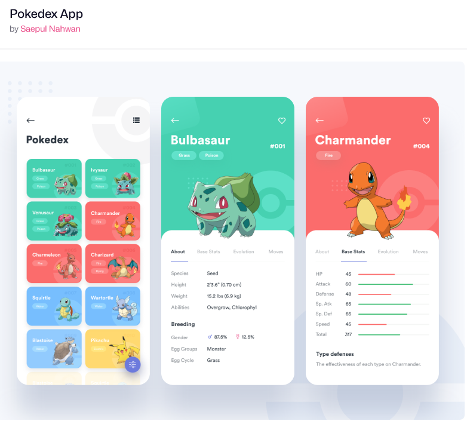

# Curso JavaScript - Plataforma DIO 🌎

## 🚀Bloco 1 - Aprenda a Programar do Zero
- [x] Primeiros Passos
- [x] Conhecendo Funções
- [x] Criando Objetos e Classes
- [x] Arrays e Estruturas de Repetição
- [x] Importação e Exportação
- [x] Desafios

## 🚀Bloco 2 -  JavaScript para Web
- [ ] Introdução ao Desenvolvimento Web com JS
- [ ] Projeto com HTML/CSS - Listagem de Pokémon
- [ ] Dominando o Protocolo HTTP e Integração com a PokeAPI
- [ ] Desafio

    - Base do projeto a ser desenvolvido
    

    
    
 
    
    > Site fonte: dribbble.com

## 🚀 Bloco 3 - Conceitos Avançados
- [ ] Variáveis, Escopo e Tipos de dados
- [ ] Orientação a Protótipo
- [ ] Funções e Manipulação de Listas
- [ ] Promises e Assincronismo

## Bloco 4 -  Desafio
- [ ] Currículo Profissional Dinâmico
