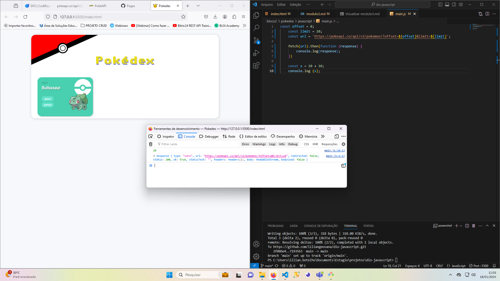
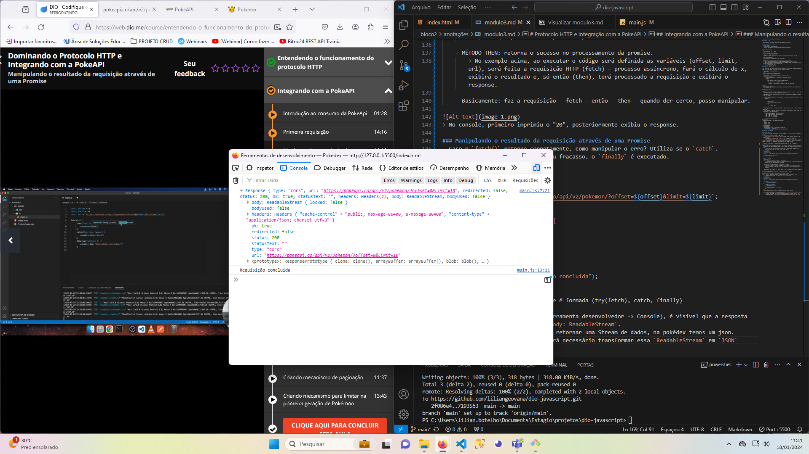
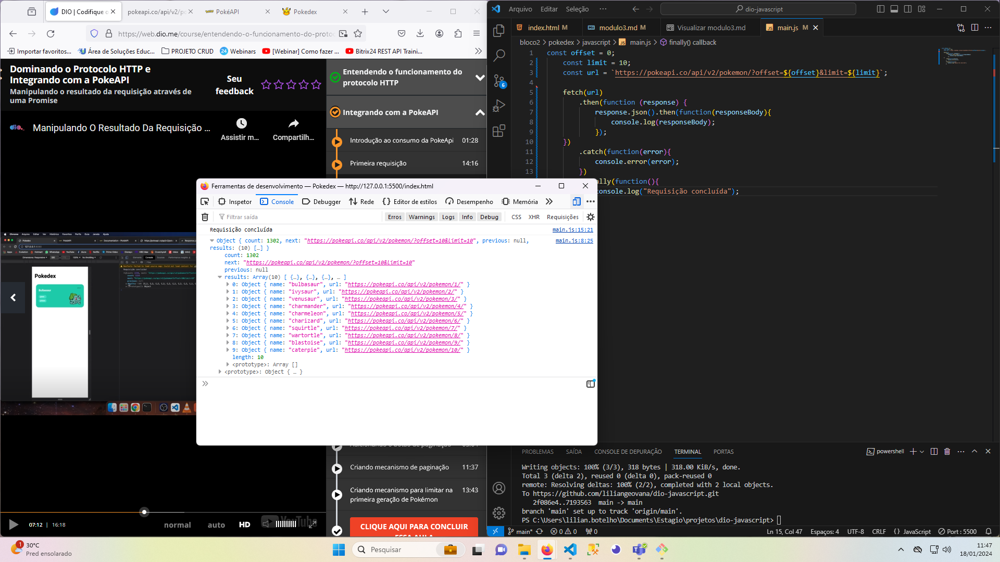

# Protocolo HTTP e Integração com a PokeAPI

## Introdução a APIs

- Uma API pode ser considerada um servidor, que disponibiliza dados.

#### Como funcionam as requisições:

- Protocolo HTTP: 
    - É um protocolo cliente/servidor.
    > Cliente faz o pedido. Servidor processa e devolve uma resposta.

#### URL, Path e Method:

- URL:
    - É composta por `IP` e `Path`
    ~~~
    https://pokeapi.co/api/v2/pokemon/
    ~~~
    IP/Endereço: https://pokeapi.co
    > O domínio também é um IP, pois é convertido em um endereço de números pelo DNS.

    PATH: /api/v2/pokemon/
    > É a identificação do queremos trazer do servidor.

- Method:
    - Sempre que é feita uma requisição pro servidor, ela tem um tipo:
    1. `GET` : se der um GET na url, o servidor entende que quero buscar o recurso.
    2. `POST`: se a API estiver seguindo os princípios de REST (padrão de projeto API), esse método indica que quero inserir um novo item.
    3. `PUT` : atualizar um item.
    4. `DELETE` : deletar um item. 

## Path Params e Query String

- Para poder fazer uma requisição ao servidor, buscando um recurso (GET), em determinado ponto é necessário fornecer dados ao servidor para que ele possa retornar.

- Há várias formas de se passar dados: 
    - Pelo PATH:
    ~~~
    https://pokeapi.co/api/v2/pokemon/${id}
    ~~~
    O atributo do `id`, passado diretamente no PATH, é dinâmico.

    - Pela Query String:
        - É uma forma de filtrar a pesquisa de um determinado recurso.
        - Sintaxe: 
            ~~~
            https://pokeapi.co/api/v2/pokemon?type=grass&name=i
            ~~~
            > Tudo depois do `?` é uma Query String

            > No exemplo, há dois filtros: tipo grass e nomes que comecem com i.

## Header
- Configuração da requisição.
    - Por exemplo, se desejo enviar para cadastro informações no formato JSON, no header faço essa configuração.

## Body e Status Code

- Body:
    - Dependendo do método que esteja sendo utilizado na requisição, há o `body` - corpo - da minha requisição, que é o dado que desejo que trafegue.

    - Método GET: não tem um body na requisição, pois a sua transferência de dados se dá pelo path e/ou header.

    -  Método POST: Desejando inserir um novo dado, o envio dos dados a serem cadastrados se dá através do body.
        Exemplo:

            
            //Request Headers
                content-type: application/json

            //Body
                {
                    "name": "AAA"
                }
    
    - O body pode ter tanto na requisição quanto na resposta (nesse cenário o GET já tem body).

- Status Code:
    - É uma resposta do servidor indicando o que aconteceu com a requisição feita. Se ela foi processada, se deu algum problema.
    
    - É um número que o servidor retorna, no qual:
        - Família 200 (200-299): sucesso na resposta.
        - 300 - 399: mensagem de redirecionamento.
        - 400 - 499: erro do cliente.
        - 500 - 599: erro do servidor.
    
    - Possui o respose header e body.

#### Resumindo:
- Mando para o servidor o que compõe uma requisição:
    - URL
    - Request Method
    - Request Header
    - Request Body

- O servidor devolve:
    - Status Code 
    - Response header: como a resposta está configurada.
    - Response body: a resposta em si.
        > O status code também pode ser uma resposta no body.

## Integrando com a PokeAPI

### Primeira requisição
- Para iniciar a listagem dos pokémons, é necessário pegar o `end-point` que será consumido da PokeAPI.

- No site `https://pokeapi.co/` temos a API, onde:
    - `https://pokeapi.co/api/v2/pokemon/`: faz a listagem dos 20 primeiros pokémons em um arquivo JSON.
        > Após pokemon/ pode-se colocar o nome ou número de um pokémon específico. 
    - `https://pokeapi.co/api/v2/pokemon/?offset=0&limit=10`: traz a listagem dos 10 primeiros.

- Assim, o que deseja ser feito? Ao iniciar a página, precisamos que o elemento que contém a listagem de pokémons - no index.html - seja preenchida, no padrão desejado.

- No Console, da ferramenta do desenvolvedor, queremos chamar via http o end-point.

#### Como fazer?
1. Realizar uma requisição http via JavaScript para consumir a end-point e trazer a listagem.
    - Como fazer uma requisição http via JS? Há várias formas, no projeto utilizou-se o `Fetch API`.  
        > Fetch API é uma biblioteca que já é integrada no JavaScript do navegador, sem necessidade de instalação. Outras seriam: Axios, Jquery.

    ~~~javascript
    const offset = 0;
    const limit = 10;
    const url = `https://pokeapi.co/api/v2/pokemon/?offset=${offset}&limit=${limit}`;

    fetch(url).then(function (response) {
        console.log(response);
    })

    const x = 10 + 10;
    console.log (x);
    ~~~
    - FETCH RETORNA UMA PROMISE (PROMESSA DE UM RESULTADO)
        > É um processo assíncrono, pois, para retornar uma requisição, é um processo de várias etapas e que pode demorar para ser processado.

    - MÉTODO THEN: retorna o sucesso no processamento da promise. 
        > No exemplo acima, ao executar o código será definida as variáveis (offset, limit, url), será feita a requisição HTTP (fetch) - processo assíncrono, fará o cálculo de x, exibirá o resultado e, só então (then), terá processado a requisição e exibirá o response.
    
    - Basicamente: faz a requisição - fetch - então - then - quando der certo, posso manipular.
        

> No console, primeiro imprimiu o "20", posteriormente exibiu o response.

### Manipulando o resultado da requisição através de uma Promise
- Caso o `fetch()` retorne corretamente, como manipular o erro? Utiliza-se o `catch`.
    - E, independente do sucesso ou fracasso, o `finally` é executado.

    ~~~javascript
    const offset = 0;
    const limit = 10;
    const url = `https://pokeapi.co/api/v2/pokemon/?offset=${offset}&limit=${limit}`;

    fetch(url)
        .then(function (response) {  
            console.log(response);
    })
        .catch(function(error){
            console.error(error);
        })
        .finally(function(){
            console.log("Requisição concluída");
        })
    ~~~
    > Assim, a estrutura da Promise é formada (try(fetch), catch, finally)

    - Ao visualizar o response (Ferramenta desenvolvedor -> Console), é visível que a resposta do body foi retornado como: `body: ReadableStream`.
        - O fetch, por padrão, vai retornar uma Stream de dados, na pokédex temos um json.
        - Para trabalhar no JS, será necessário transformar essa `ReadableStream` em `JSON`

        
        >Console: response.
    
    - Dessa forma, no código JS, o próprio `response` já possui o `.json`:
        ~~~javascript
        .then(function (response) {

            response.json().then(function(responseBody){
                console.log(responseBody);
            });

        })
         ~~~

         
         > Console: response já em json.

- Porém, para tratar o assincronismo, começa a ter muitos callbacks (função dentro de função), o que não é muito recomendado.
    - Assim, pode-se encadear os `then()` e utilizar `Arrow Functions =>`

    ~~~javascript
    const offset = 0;
    const limit = 10;
    const url = `https://pokeapi.co/api/v2/pokemon/?offset=${offset}&limit=${limit}`;

    fetch(url)
        .then(response => {  
            return response.json()
        })
        .then(jsonBody => {
            console.log(jsonBody);
        })
        .catch(error => {
            console.error(error);
        })
        .finally(function(){
            console.log("Requisição concluída");
        })
    ~~~

    - Além disso, tendo apenas um `return`, pode-se reduzir:

    
    ~~~javascript
    fetch(url)
        .then((response) =>  response.json())
        .then((jsonBody) => console.log(jsonBody))
        .catch((error) =>  console.error(error));
    ~~~
    1. Primeiro then: transforma o `response` em uma promessa do body convertido em json
    2. Segundo then: recebendo o body convertido e printando

    